# BANG! iOS

# Önlab - iOS alapú szoftverfejlesztés
Kocka Dominik Csaba (FIBRPN)

Konzulens: Ekler Péter

# BANG!

Társasjáték

A Bang\! olasz\, western\-keretmesés\, kiesős kártyajáték\.

Minden játékosnak van egy karaktere\, ez határozza meg\, hogy milyen szabályok vonatkoznak rá\.

A Bang\!\-et 4–7 fő játszhatja\, bár vannak módosított szabályok ettől eltérő létszám esetére is\.

# Kihívások

A Feladat

* Elkészíteni ennek a játéknak az iOS verzióját:
  * Megismerni a SwiftUI rejtelmeit\.
  * Megtervezni a játék kódbeli implementációját
  * Megtervezni egy UI\-t\.
  * Választani design patternt\.
  * Megszerezni az asseteket\.
  * Implementálni a terveket\.
  * Debugolni a munkát\.

# Ütemterv

1\. pár hét: Ismerkedés a SwiftUI rejtelmeivel és a hozzá tartozó kódolási konvenciókról

4\.\-5\. hét: Assetek megszerzése\. Interneten nincs\, ezért scannelgetéssel\.

6\.\-8\. hét: Tervezési fázis\, UI megtervezése\, játék architektúrájának átgondolása\.

9\.\-11\. hét: Megtervezett architektúra implementálása\.

12\.\-13\. hét: UI és játékmenet implementálása\.

14\. hét: Debugging\.

# A Swift és a SwiftUI

Felhasznált technológia

# Swift

programozási nyelv

A Swift egy magas szintű\, általános célú\, többparadigmás rendszer\- és alkalmazásprogramozási nyelv\, amelyet az Apple cég fejleszt\.

Jelenleg nyílt forráskódú

Protokollok \(Interfészek helyett\)

"Objective\-C\, a C nélkül”

# SwiftUI

interface

A SwiftUI egy apple által tervezett keretrendszer felhasználói felületek készítésére Swift nyelven\.

Minden apple terméken futnak az így készült felületek\.

Egy dekleratív Swift sintaxissal készülnek a felületek\.

Autómatikusan támogatja a dinamikus képernyőméretet és a sötét módot\, valamint minden kisegítő lehetőséget\.

# Az architektúra

# Egyszerű típusok

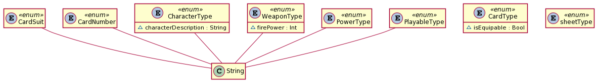

* CardSuit\, CardNumber\, CardType:
    * Ezek a típusok a Kártyák azonosítására használtak\.
* CharacterType:
    * A karakter azonosítására\.
* WeaponType\, PowerType\, PlayableType:
    * A kártyák képességének azonosítására\.
* WeaponType:
    * A fegyver azonosítására\.
* SheetType:
    * A UI\-ban prezentálandó választó menü típusának azonosítására\.

# Player, Character

* Player:
    * Ez az osztály reprezentál egy játékost\.
* Character
    * Ez az osztály az absztrakt ősosztálya a különböző karakter típusoknak\.

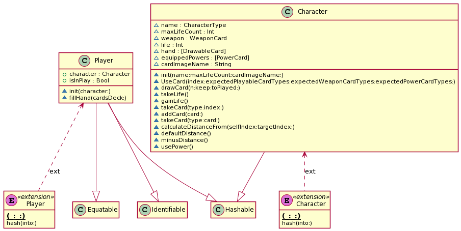

# Card Type-ok

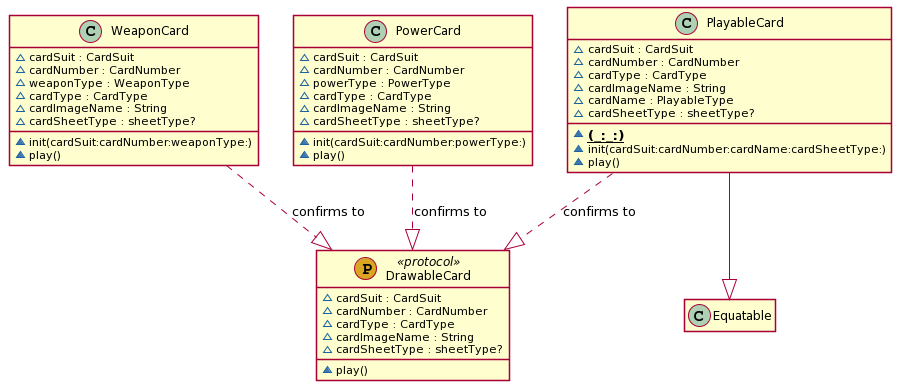

* DrawableCard:
    * Ez a protocol definiálja a húzható kártyákat\, amit a pakliban és a játékos kezében lehet tárolni\.
* WeaponCard\*:
    * A fegyver típusú kártyákat reprezentálja\.
* PowerCard\*:
    * A különböző extra képességgel felruházó kártyákat reprezentálja\, ami változtathat a játék menetén\.
* PlayableCard:
    * A kijátszható kártyákat reprezentálja\, amivel a játék menetet vihetjük tovább\.

\* Jelenleg nincsenek ilyenek implementálva\, de a funkció be van építve a működésbe\.

# Game

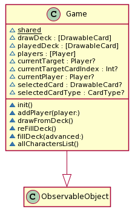

Ez a singleton osztály irányítja a játék teljes lefolyását\.

Tartalmazza a húzó és az eldobott paklit\.

Tartalmazza a játékosokat\.

Tartalmazza a kiválasztott játékost és/vagy lapot\.

# Playable card-ok

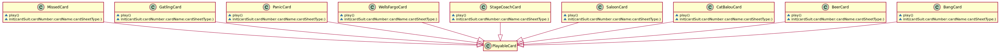

* Ezek a típusok\, mind a Playable Card osztályból származnak le és ezeket tudjuk kijátszani a körünkben\.
* Mindegyiknek van egy play\(\) metódusa\, ami megvalósítja a kártya funkcióját\.
* A következők lehetnek:
    * BangCard\, GatlingCard\, SaloonCard\, BeerCard\, MissedCard\, StageCoachCard\, CatBalouCard\, PanicCard\, WellsFargoCard

# Character-ek

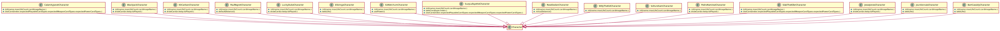

* Ezek a típusok\, mind a Character osztályból származnak le és ezeket példányosítjuk karakter választásnál a játék elején\.
* A különböző lépéseket felüldefiniálják a saját “képességük”\-nek megfelelően\.
* A következők lehetnek:
    * BartCassidyCharacter \, PaulRegretCharacter \, BlackJackCharacter\, PedroRamirezCharacter\, CalamityJanetCharacter\, RoseDoolanCharacter\, ElGringoCharacter\, SidKetchumCharacter\, JesseJonesCharacter\, SlabTheKillerCharacter\, JourdonnaisCharacter\, SuzyLafayetteCharacter\, KitCarlsonCharacter\, VultureSamCharacter\, LuckyDukeCharacter\, WillyTheKidCharacter

A kész app

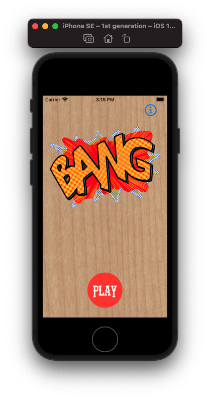

# Kezdőképernyő

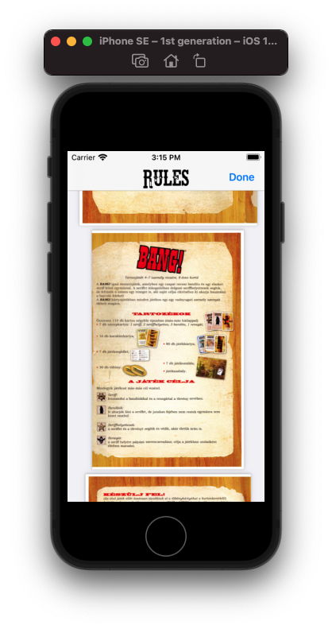

# Szabályok

# Character Választó

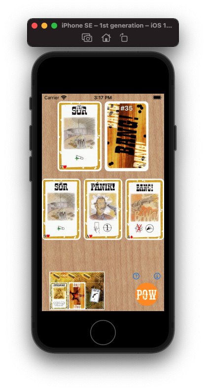

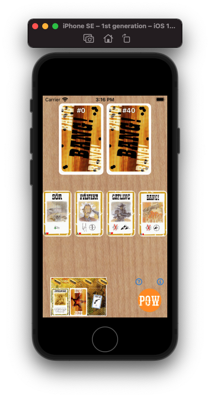

# A játék

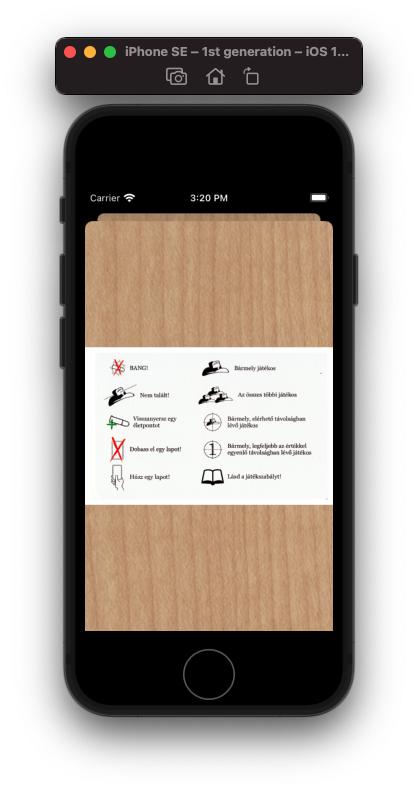

# Quick Help

# Választók

További lehetőségek

# További lehetőségek

Következő félévekre

Power kártyák készítése\.

Weapon kártyák készítése\.

Akármely kártyatípusból újak hozzáadása\.

Multiplayer implementálása\. \(pl\.: Spring boot backend \- ALF\)

Szebb UI kialakítása\.

Eredeti társas kiegészítőinek hozzáadása\.

Macos\-re való átalakítás

